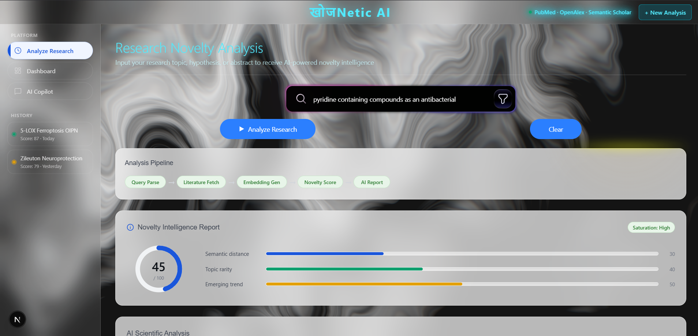
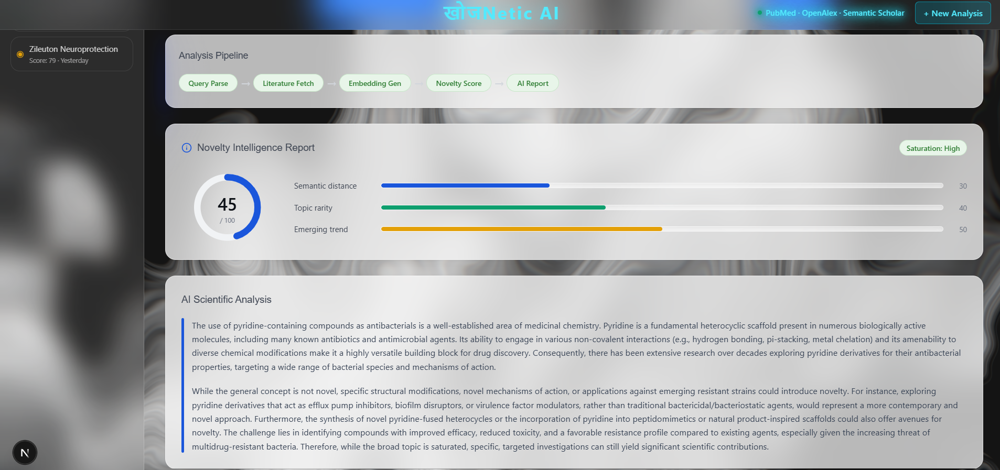
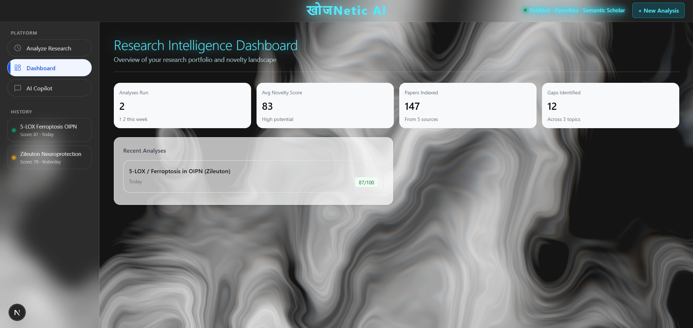
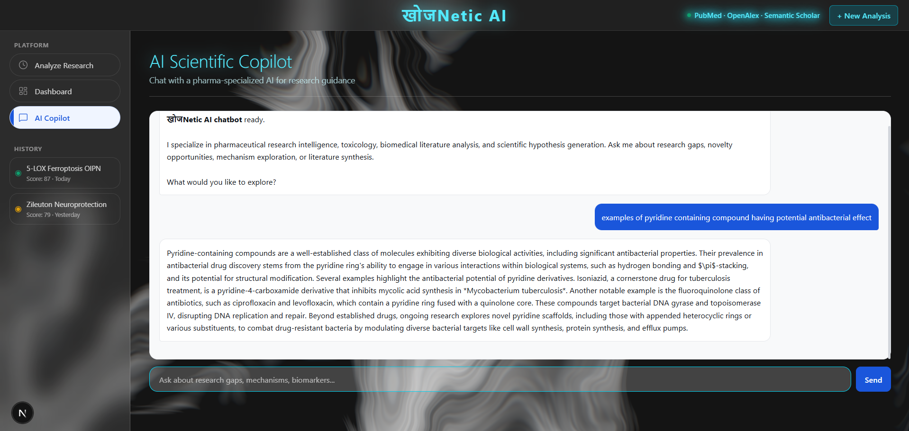

# खोजNetic AI — Research Intelligence Platform

> AI-native pharmaceutical research intelligence. Analyze any research topic or hypothesis and get instant novelty scoring, literature saturation analysis, and scientific gap detection.

[](https://nextjs.org)
[](https://fastapi.tiangolo.com)
[](https://openrouter.ai)

---

## Screenshots

### Research Novelty Analysis


### Novelty Intelligence Report


### Research Intelligence Dashboard


### AI Scientific Copilot


---

## Features

- **Novelty Scoring** — AI-powered score (0–100) measuring how novel a research topic is against existing literature
- **Saturation Analysis** — Determines if a research area is Low / Medium / High saturated
- **Component Breakdown** — Semantic distance, topic rarity, citation scarcity, emerging trend, cross-domain, and methodological scores
- **Similar Papers** — Surfaces related literature with similarity percentages and key differences
- **AI Recommendations** — Actionable opportunities, cautions, and methodology suggestions
- **AI Copilot** — Conversational pharma research assistant for deep-dive Q&A
- **Research Dashboard** — Portfolio overview with novelty trends and analysis history

## Data Sources

Literature intelligence drawn from:
- PubMed · OpenAlex · Semantic Scholar · CrossRef · Europe PMC · bioRxiv · ClinicalTrials.gov · OpenFDA

---

## Tech Stack

| Layer | Technology |
|-------|-----------|
| Frontend | Next.js 16, TypeScript, Tailwind CSS v4 |
| Backend | FastAPI, Python, Pydantic |
| AI Model | Gemini 2.5 Flash via OpenRouter |
| Styling | Tailwind CSS, custom neon/glassmorphism UI |

---

## Getting Started

### Prerequisites
- Node.js 18+
- Python 3.10+
- An [OpenRouter](https://openrouter.ai) API key

### 1. Clone the repo

```bash
git clone https://github.com/nick774776/KhojNectic.AI.git
cd KhojNectic.AI
```

### 2. Start the API

```bash
cd apps/api
pip install -r requirements.txt
```

Create `apps/api/.env`:
```env
OPENROUTER_API_KEY=your_openrouter_api_key_here
```

```bash
uvicorn main:app --reload --port 8000
```

API runs at → http://localhost:8000

### 3. Start the Frontend

```bash
cd apps/web
npm install
npm run dev
```

Frontend runs at → http://localhost:3000

---

## Project Structure

```
apps/
  web/          # Next.js frontend
  api/          # FastAPI backend
```

---

*Built with खोजNetic AI — where research meets intelligence.*
